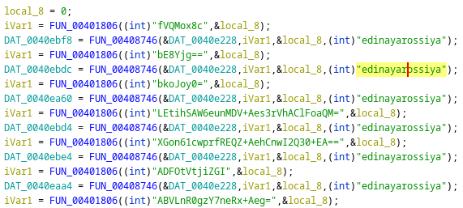

# 0. Encryption
Many strings in the malware have been encrypted with RC4 and then base64 encoded.
There is a function in the malware that decrypts most of the strings and stores them in memory, where the main cipher key can be seen: `"edinayarossiya"`.

## [1. The decryption process](1-decryption-process.md)

## [2. Back-tracing encrypted strings](2-back-tracing.md)

## [3. Decrypting strings](3-decrypting-strings.md)